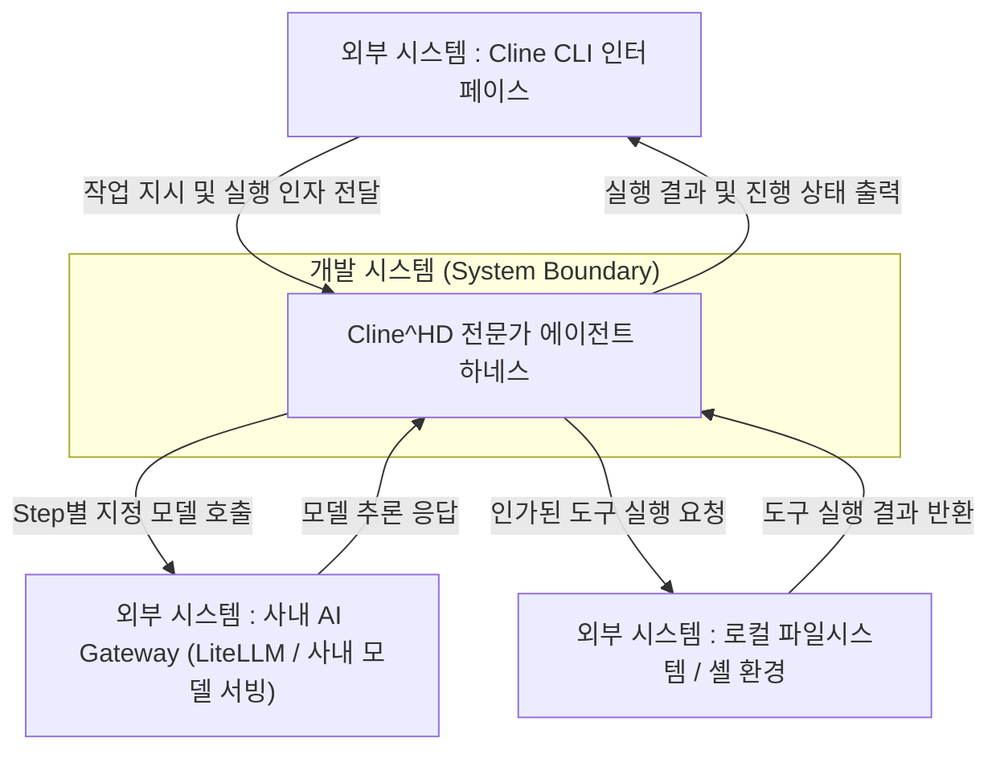

# [초기 요구사항 정의서] 전문가 에이전트 실행을 위한 Cline^HD 하네스

---

## 1. 과제 개요 및 핵심 목표

### 1.1 과제명
**전문가 에이전트 실행을 위한 Cline^HD 하네스 설계**

### 1.2 핵심 목표
> **"Cline^HD 사용자가 테스트 작성, 로그 분석 등 복잡한 개발 작업을 지시하면, 단계를 나누어 지정된 역할과 목적에만 집중하여 완수해주는 전문가 에이전트 실행 기능을 제공한다."**

- **배경 및 범위**:
  - 기존 오픈소스 Cline의 단일 루프 실행 방식은 복잡한 작업 시 대화 이력 누적(Context Window 과부하)으로 인해 지시 불이행, 환각, 비용 급증 및 복구 실패 문제가 발생함.
  - 이를 해결하기 위해 작업을 Step 단위로 분할하고, Step별 전용 프롬프트·도구 셋·사전정보를 패키징한 '전문가 에이전트 실행 하네스'를 구축함.
  - **1차 검증 환경**: 개발 및 검증의 신속성을 위해 **Cline CLI 기반** 환경에서 기능을 우선 구현·검증하며, VS Code 확장은 향후 단계로 연계함.

---

## 2. 이해관계자 (Stakeholders)

| ID | 이해관계자 구분 | 핵심 관심사 (Needs & Concerns) | 관련 목표 ID |
| :--- | :--- | :--- | :--- |
| **SH-01** | **사내 소프트웨어 개발자 (User)** | • 많은 맥락 파악이 필요하고 빈번히 반복되는 개발 작업(테스트 작성, 로그 분석 등)을 전문가 에이전트를 통해 일관된 고품질로 완수 • 특정 업무 목적에 맞게 원하는 도구(Tools)와 프롬프트를 직접 지정·제어하여 전문가 에이전트를 생성 및 활용 • 비인가 파일 덮어쓰기나 위험한 셸 명령 실행 없이 안전하게 실행 | **GOAL-01** (작업 효율성/완수율, 사용자 도구 제어/확장성 및 안전성) |
| **SH-02** | **Cline^HD 플랫폼 개발자** | • 사용자가 도메인 지식을 결합해 직접 에이전트를 확장할 수 있는 모듈형 플러그인 구조 확보 • 오픈소스 업스트림 신규 버전 주기적 릴리즈에 대한 마이그레이션(병합/동기화) 노력 및 재작업 최소화 | **GOAL-02** (도메인 확장성 및 오픈소스 마이그레이션 용이성) |
| **SH-03** | **사내 AI Gateway(LiteLLM) 및 모델 서빙 담당자** | • 사내 서빙 모델의 고른 활용 및 특정 모델로의 부하 쏠림 방지 • 사내 데이터 보호 및 AI 거버넌스를 위한 인프라 가드레일/정책 준수 | **GOAL-03** (인프라 자원 효율화 및 가드레일/정책 준수) |

---

## 3. 시스템 경계 및 컨텍스트 (System Context)

본 시스템은 **Cline CLI**를 통해 사용자의 지시를 받아 작업을 Step 단위로 분할 실행하고, 런타임에서 도구 접근 권한을 제어하며, 사내 AI Gateway(LiteLLM) 및 로컬 작업 환경과 상호작용한다.

---

## 4. 기능 요구사항 (Functional Requirements)

| 요구사항 ID | 기능 명칭 | 상세 내용 |
| :--- | :--- | :--- |
| **FR-01** | **사용자 정의 전문가 에이전트 생성 및 패키징** | • 사용자가 특정 업무 목적(예: 테스트 작성, 로그 분석, 코드 리뷰 등)에 맞는 전문가 에이전트를 직접 생성·추가할 수 있어야 함. • 각 에이전트의 전용 프롬프트, 허용 도구 셋(Allowlist), 사전 지식(Prerequisites), Step 분할 구조를 선언적 파일(설정/명세)로 정의하고 하네스에 즉시 등록·호출할 수 있어야 함. |
| **FR-02** | **단계별(Step-by-Step) 작업 분할 및 실행** | • 복잡한 사용자 지시를 다단계(예: 탐색 $\rightarrow$ 분석 $\rightarrow$ 작성 $\rightarrow$ 검증)로 분할하여 순차적으로 실행하고 수명주기를 관리해야 함. |
| **FR-03** | **런타임 훅 기반 도구 접근 권한 제어** | • 에이전트 실행 중 도구 호출을 런타임 레벨에서 인터셉트하여, 지정된 역할(예: Read-Only 분석)에 벗어나는 비인가 도구(파일 쓰기/셸 실행 등) 호출을 원천 차단해야 함. |
| **FR-04** | **Step 간 필수 맥락(Memory) 전달** | • 전체 대화 이력을 누적하지 않고, 이전 Step의 핵심 결과물(Artifact/Summary)만 선별하여 다음 Step으로 전달함으로써 컨텍스트 비대화를 방지해야 함. |
| **FR-05** | **Step별 사내 서빙 모델 지정** | • Step 특성(심층 분석, 단순 요약, 코드 생성 등)에 맞게 사내 AI Gateway에서 제공하는 서빙 모델 중 사용할 모델을 사용자가 지정할 수 있어야 함. |

---

## 5. 비기능 및 제약사항 (Constraints)

| 제약사항 ID | 구분 | 내용 |
| :--- | :--- | :--- |
| **CON-01** | **오픈소스 기반 및 마이그레이션 용이성** | 오픈소스 Cline의 **원본 코어 수정을 최소화하고 독립된 하네스 계층을 통해 기능을 확장**함으로써, 주기적인 오픈소스 버전 업데이트(마이그레이션) 시 충돌과 재작업 노력을 최소화해야 함. |
| **CON-02** | **1차 검증 환경** | 1차 프로토타입 및 품질 검증은 **Cline CLI 환경**을 타깃으로 진행하며, VS Code 확장은 추후 단계에서 연계함. |
| **CON-03** | **사내 AI Gateway 연동** | 사내 AI Gateway(LiteLLM) 연동 시 서빙 인프라의 가드레일 및 보안 정책을 준수해야 함. |

---

## 6. 품질 요구사항 (Quality Attributes)

> **품질속성 출처 노트**:
> 본 시스템의 품질 요구사항은 **ISO/IEC 25059 (AI 시스템 품질 모델)** 표준 속성(Controllability, Performance Efficiency, Functional Correctness) 및 SW 아키텍처 품질 속성(Modifiability)을 기반으로 정의함.

| ID | 품질 속성 | 측정 시나리오 | 정량적 산출식 | 목표 수치 (Target) |
| :--- | :--- | :--- | :--- | :--- |
| **QA-01** | **Controllability (AI 제어 가능성)** | Read-Only 전문가 에이전트 실행 중 비인가 도구(파일 쓰기/셸 실행) 호출 지시가 주입될 때, 런타임 훅이 이를 100% 차단하고 안전하게 작업을 완료함. | $$\text{제어 성공률} = \left(\frac{\text{비인가 도구 호출 없이 안전 완료된 태스크 수}}{\text{전체 비인가 도구 호출 유도 태스크 수}}\right) \times 100$$ | **100.0%** |
| **QA-02** | **Performance Efficiency (AI 수행 효율성 - 하네스)** | 복잡한 개발 작업 수행 시, 컨텍스트 윈도우 과부하를 방지하여 높은 작업 완료율을 달성하고 단일 루프 대비 토큰 사용량을 비교 측정함. | • $\text{Task Success Rate} = \left(\frac{\text{성공 Task 수}}{\text{전체 Task 수}}\right) \times 100$ • $\text{요청당 토큰 사용량} = \frac{\sum(\text{Input} + \text{Output Token})}{\text{요청 수}}$ | • **Task Success Rate $\ge$ 90% 이상** • **토큰 사용량 비교 분석** (단일 루프 대비 토큰 소비량 비교 및 영향도 확인) |
| **QA-03** | **Functional Correctness (AI 기능 정확성)** | 전문가 에이전트(테스트 작성, 로그 분석 등)를 Step 분할 구조로 실행했을 때, 작업 분할로 인한 맥락 유실 없이 일반적인 기대치 수준의 높은 결함 검출 및 분석 정확도를 달성함. | • **F1-Score**: $2 \times \frac{\text{Precision} \times \text{Recall}}{\text{Precision} + \text{Recall}}$   *(Precision = $\frac{TP}{TP+FP}$, Recall = $\frac{TP}{TP+FN}$)* | • **F1-Score $\ge$ 0.85 (85%) 이상 달성**   - 테스트 에이전트: Mutation 결함 검출 Kill Rate   - 로그 에이전트: 이상 로그 탐지 및 분류 F1 |
| **QA-04** | **Performance Efficiency (AI 수행 효율성 - 모델 최적화)** | Task 및 세부 Step 특성(탐색/분석/작성)에 따라 사내 서빙 모델을 적절히 지정하여 품질을 유지하면서 토큰 소비 효율을 최적화함. | • Step별 토큰 사용량 (Input/Output Token) | • Task/Step별 최적 모델 조합 가이드 도출 및 토큰 절감 효과 확인 |
| **QA-05** | **Modifiability (변경 용이성)** | 사용자가 새로운 업무 목적의 전문가 에이전트(예: 코드 리뷰어, API 문서 생성기 등)를 생성하여 추가할 때, 기존 하네스 코어 코드 수정 없이 정의 파일 작성 및 등록만으로 즉시 정상 동작해야 함. | • **신규 에이전트 무수정 동작 완료율 (Zero-Code Extension Success Rate)**   - 산출식: $\left(\frac{\text{코어 코드 수정 없이 정상 실행 및 태스크를 완수한 에이전트 수}}{\text{신규 등록 시도 에이전트 수}}\right) \times 100$ | • **100.0%** (코드 수정 0건으로 신규 에이전트 100% 정상 구동 달성) |
