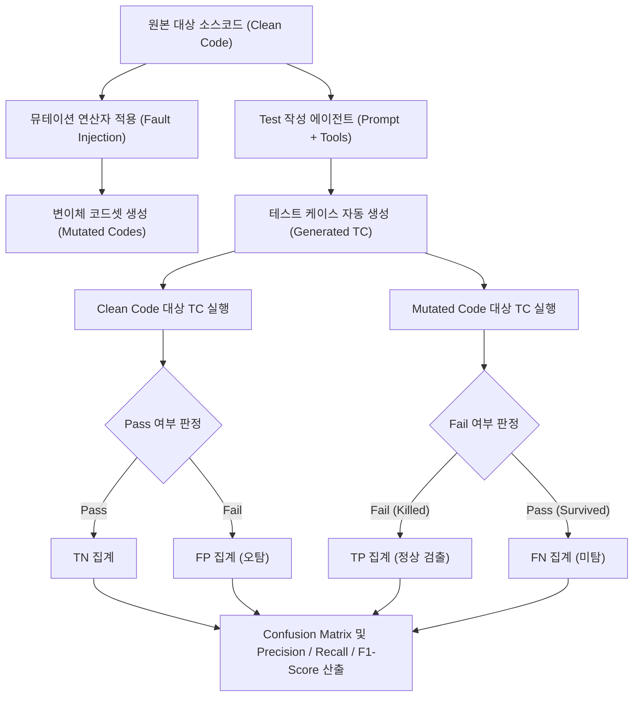

# [기술 문서] Test 작성 에이전트 검증을 위한 Mutation Testing 기반 평가 체계

## 1. 개요 및 배경

### 1.1 필요성
- LLM 기반의 **Test 작성 전문가 에이전트**가 생성한 테스트 코드(TC)의 품질을 단순히 라인 커버리지(Line Coverage)로만 측정할 경우, 실질적인 검증 로직(Assertion) 없이 코드만 실행(Execute)하고 지나가는 맹점이 존재함.
- 따라서 코드에 인위적으로 결함을 주입하는 **Mutation Testing(뮤테이션 테스팅)** 기법을 적용하여, 에이전트가 생성한 TC가 **실제 결함을 정확히 검출(Fail)해내는지**를 정량적으로 평가함.

---

## 2. 혼동 행렬(Confusion Matrix) 정의

결함 주입 여부(Ground Truth)와 생성된 TC의 실행 결과(Test Result)를 기준으로 다음과 같이 정의함.

| 구분 | **결함 주입 코드 (Mutated Code)** *(Actual Positive)* | **정상 원본 코드 (Clean Code)** *(Actual Negative)* |
| :--- | :--- | :--- |
| **TC 실행 결과: Fail (결함 검출)** *(Predicted Positive)* | **True Positive (TP)** • 주입된 결함을 정상 검출하여 TC Fail 발생 • *Mutant Killed* (정상 검출) | **False Positive (FP)** • 결함 없는 정상 코드인데 잘못 작성되어 TC Fail • *Broken/Flaky Test* (오탐) |
| **TC 실행 결과: Pass (정상 통과)** *(Predicted Negative)* | **False Negative (FN)** • 결함이 주입되었으나 TC가 감지 못하고 Pass • *Mutant Survived* (미탐/결함 누락) | **True Negative (TN)** • 정상 코드에 대해 정상적으로 TC Pass 통과 • *Clean Test Pass* (정상 통과) |

---

## 3. 평가 메트릭 (Metrics) 및 산출식

### 3.1 Precision (정밀도)
- **개념**: 에이전트가 생성한 TC가 Fail을 발생시켰을 때, 실제로 결함이 존재했던 비율 (오탐 최소화 지표)
$$\text{Precision} = \frac{TP}{TP + FP}$$
- **해석**: 정상 코드에서 오작동하지 않고 올바르게 검증을 수행하는 테스트 코드의 신뢰성을 의미함.

### 3.2 Recall (재현율 / Mutation Score)
- **개념**: 주입된 전체 결함 중에서 생성된 TC가 Fail로 성공적으로 잡아낸 비율 (결함 검출력 지표)
$$\text{Recall} = \frac{TP}{TP + FN}$$
- **해석**: 코드 내 잠재적 결함을 놓치지 않고 얼마나 꼼꼼하게 잡아내는지를 의미함.

### 3.3 F1-Score (종합 기능 정확성)
- **개념**: 정밀도(Precision)와 재현율(Recall)의 조화평균
$$\text{F1-Score} = 2 \times \frac{\text{Precision} \times \text{Recall}}{\text{Precision} + \text{Recall}}$$
- **목표치**: **90.0% 이상** 달성

---

## 4. 평가 파이프라인 (Benchmark Workflow)

### 4.1 세부 절차
1. **벤치마크 코드셋 선정**: 정답 로직이 명확한 오픈소스 및 사내 라이브러리 모듈 선정.
2. **결함 주입(Mutation)**:
   - 조건문 반전 (`>` $\rightarrow$ `<=`)
   - 산술 연산자 변조 (`+` $\rightarrow$ `-`)
   - 경계값 변경 (`i < len` $\rightarrow$ `i <= len`)
   - 반환값 변경 (`return true` $\rightarrow$ `return false`)
3. **에이전트 실행**: Test 작성 전문가 에이전트에게 대상 함수 및 요구명세를 입력하여 단위 테스트(TC) 생성 지시.
4. **결과 판정 및 집계**: 생성된 TC를 Clean 및 Mutated 환경에서 자동 실행하여 F1-Score 산출.

---

## 5. 심사위원 대응 논리 및 기대효과

- **정량적 타당성**: 기존의 정성적 코드 리뷰나 단순 커버리지 측정이 가진 "Assertion 누락" 문제를 Mutation Testing을 통해 완벽히 극복함.
- **ISO/IEC 25059 기능 적합성(Functional Correctness) 부합**: 실제 정답지(주입된 결함)가 존재하는 환경에서 오탐(FP)과 미탐(FN)을 엄밀히 분리하여 측정하므로, 심사자에게 객관적이고 반박 불가능한 정량 근거를 제시함.
