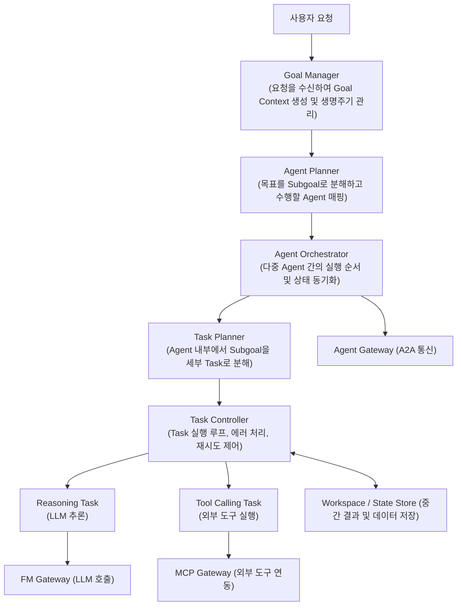

# AISystem_DesignPattern 폴더 파일별 핵심 요약 레퍼런스

> 본 문서는 `reference/AISystem_DesignPattern/` 폴더 내에 위치한 4개 PDF 문서의 원본 목차와 핵심 내용을 문서별로 빠짐없이 체계적으로 정리한 요약 레퍼런스입니다.

---

## 1. [문서 1] 10-AI-Design-Patterns.pdf 요약

### 1.1 문서 개요
- **주제**: AI 시스템 설계를 위한 8대 핵심 설계 문제(Design Problems) 및 문제별 해결 패턴 종합 개요
- **구성**: AI 설계 문제 정의 $\rightarrow$ 8대 문제별 후보 패턴 구조 및 특징 제시

### 1.2 8대 설계 문제(Design Problems) 및 패턴 일람표
| 번호 | 설계 문제 (Design Problem) | 주요 해결 과제 | 포함된 대표 패턴 |
| :---: | :--- | :--- | :--- |
| **Problem 1** | **ML Task / Model Pipeline Composition** | 다중 모델/태스크의 순차·병렬 조합 및 파이프라인 구성 | - Static Linear ML Model Chain - Centralized ML Model Orchestration - Cascaded Model Composition |
| **Problem 2** | **Model Selection & Routing** | 런타임 조건/요청에 따른 최적 모델 선택 및 라우팅 | - Static Model Endpoint Binding - App-side Selection / Client-side Discovery - Policy-based Model Broker / Router |
| **Problem 3** | **Model Serving Deployment** | 모델 및 연산 자원의 물리적 배포 위치 결정 | - Local Edge Deployment - Centralized Server Deployment - Hybrid Split Deployment |
| **Problem 4** | **State / Feature Acquisition Accuracy** | 추론에 필요한 컨텍스트/피처 데이터의 정확성 및 무결성 확보 | - Raw Event History Preservation - Time-windowed State Aggregation - Point-in-time Feature Retrieval |
| **Problem 5** | **Feature Serving Efficiency** | 실시간 추론 시 대량의 피처를 지연 없이 공급 | - Request-embedded Feature Passing - On-demand Feature Computation - Pre-materialized Feature Serving |
| **Problem 6** | **Prediction Reliability Control** | 비결정론적 AI 출력, 환각, 악의적 입력 통제 | - Input / Feature Validation Gate - Confidence-based Decision Gate - Independent Verification and Review |
| **Problem 7** | **Inference Serving Performance Efficiency**| 요청 지연시간(Latency)과 시스템 처리량(Throughput) 최적화 | - Real-time Single Inference - Dynamic Batching Inference - Asynchronous Queue-based Inference |
| **Problem 8** | **Model Monitoring & Evolution Support** | 데이터 드리프트 감지 및 무중단 모델 진화/배포 | - Operational Logging & Drift Monitoring - Shadow Evaluation & Safe Model Swap - Continuous Retraining Pipeline (Shadow/Canary/A-B) |

---

## 2. [문서 2] 10.1-AI_Design_Patterns_Part1.pdf 요약

> **범위**: Problem 1부터 Problem 4까지의 4대 설계 영역, 총 12개 세부 패턴의 C&C(Component & Connector) 구조 및 평가·적용 가이드

### [Problem 1] AI 서비스 조합 (AI Service Composition)
복수 모델이나 분석 단계를 결합하여 복합적인 추론 결과를 생성하는 구조.

#### 1-1. 정적 선형 파이프라인 패턴 (Static Linear Pipeline Pattern)
- **구조 (C&C View)**: `Client` $\rightarrow$ `Step 1 Model` $\rightarrow$ `Step 2 Model` $\rightarrow$ `Step 3 Model` (단방향 직렬 파이프라인).
- **장점**: 구조가 매우 단순하고 직관적, 컴포넌트 간 오버헤드 최소화, 실행 흐름과 지연 시간 예측 가능.
- **단점**: 런타임 동적 분기 불가, 앞선 모델의 오류가 후속 모델로 증폭(Error Propagation), 변경 유연성 부족.
- **적용 및 주의점**: 전처리 $\rightarrow$ 특징추출 $\rightarrow$ 최종분류처럼 단계가 고정된 Task에 적합. 파이프라인 중간 단계의 데이터 계약(스키마) 변경에 취약하므로 인터페이스 표준화 필요.

#### 1-2. 중앙 집중형 오케스트레이션 패턴 (Centralized Orchestration Pattern)
- **구조 (C&C View)**: `Client` $\rightarrow$ `Orchestrator` $\rightleftarrows$ (`Model A`, `Model B`, `Model C`). 오케스트레이터가 흐름을 중재.
- **장점**: 복잡한 조건 분기, 오류 시 대체 경로(Fallback) 및 재시도 제어 용이, 실행 흐름의 중앙 가시성 확보.
- **단점**: 오케스트레이터가 단일 장애점(SPOF)이자 병목이 될 수 있음, 통신 홉 수 증가로 인한 지연 시간 발생.
- **적용 및 주의점**: 다단계 의사결정 및 워크플로우 제어가 필요한 시스템에 적합. 오케스트레이터의 상태 관리(Stateless vs Stateful) 분리 필수.

#### 1-3. 캐스케이드 모델 파이프라인 패턴 (Cascaded Model Pipeline Pattern)
- **구조 (C&C View)**: `Client` $\rightarrow$ `Fast/Lightweight Model` $\rightarrow$ [신뢰도 임계값 판단] $\rightarrow$ 부족 시 `Heavy/High-accuracy Model`로 단계적 위임.
- **장점**: 대다수 일반 요청을 경량 모델로 신속 처리하여 연산 비용과 평균 응답 시간 대폭 절감.
- **단점**: 고난도 요청의 경우 두 모델을 모두 거치므로 최악 지연 시간(Worst-case Latency) 증가, 임계값(Threshold) 튜닝 난이도.
- **적용 및 주의점**: 비용 절감이 절실한 대규모 서비스(예: 온디바이스 SLM 1차 처리 후 클라우드 LLM 2차 처리)에 적용.

---

### [Problem 2] AI 서비스 결정 (Model Selection & Routing)
요청 조건, 사용자 권한, 데이터 특성에 따라 적합한 모델 엔드포인트를 결정하는 구조.

#### 2-1. 정적 엔드포인트 바인딩 패턴 (Static Endpoint Binding Pattern)
- **구조 (C&C View)**: 클라이언트가 특정 모델 엔드포인트의 주소를 직접 지정하여 호출.
- **장점**: 중개 계층이 없어 구현이 가장 단순하고 통신 오버헤드 제로.
- **단점**: 모델 변경/교체 시 클라이언트 재배포 필요, 동적 트래픽 전환 및 로드밸런싱 불가.

#### 2-2. 클라이언트 사이드 디스커버리 패턴 (Client-side Discovery Pattern)
- **구조 (C&C View)**: 클라이언트가 `Service Registry`에서 모델 메타데이터를 조회하여 직접 적합한 모델을 선택·호출.
- **장점**: 중간 프록시 없이 직접 통신하므로 병목이 없고, 클라이언트 로컬 컨텍스트를 반영한 선택 가능.
- **단점**: 모델 선택 로직이 클라이언트에 분산되어 정책 변경 시 전체 클라이언트 업데이트 필요.

#### 2-3. 동적 서비스 브로커/라우터 패턴 (Dynamic Service Broker/Router Pattern)
- **구조 (C&C View)**: 클라이언트는 단일 `Broker/Router`로 요청하고, 라우터가 입력 복잡도/비용/SLA 정책에 따라 백엔드 모델 풀로 동적 라우팅.
- **장점**: 클라이언트와 모델 간 완전한 결합도 분리, 중앙 정책 변경으로 즉각 제어 가능, 장애 시 자동 페일오버.
- **단점**: 라우터 컴포넌트의 가용성 관리 필수, 미세한 네트워크 홉 지연 발생.

---

### [Problem 3] AI 서비스 배포 (AI Service Deployment)
연산 자원과 모델을 물리적 노드(디바이스 vs 서버)에 배치하는 방식.

#### 3-1. 로컬 엣지 배포 패턴 (Local Edge Deployment Pattern)
- **구조 (Deployment View)**: 모델이 사용자 단말/IoT 디바이스 내부에 직접 배포되어 로컬에서 추론 수행.
- **장점**: **네트워크 지연 시간 제로**, **오프라인 동작 가능**, 데이터가 외부로 나가지 않아 **프라이버시(Privacy) 완벽 보장**.
- **단점**: 디바이스 연산 자원/메모리/배터리 제약으로 대형 모델 배포 불가(경량/양자화 모델 한정), 모델 업데이트 배포 비용.

#### 3-2. 중앙 서버 배포 패턴 (Centralized Server Deployment Pattern)
- **구조 (Deployment View)**: 클라우드/데이터센터 고성능 GPU 인프라에 모델을 집중 서빙.
- **장점**: 대규모 최신 파운데이션 모델(LLM) 구동 가능, 중앙 집중식 버전 관리 및 모니터링 용이.
- **단점**: 네트워크 연결 필수, 통신 지연 시간 발생, 클라우드 호스팅/GPU 인프라 비용 증가, PII 데이터 전송 위험.

#### 3-3. 하이브리드 분할 배포 패턴 (Hybrid Split-Deployment Pattern)
- **구조 (Deployment View)**: 엣지 디바이스(전처리, 개인정보 마스킹, 1차 경량 추론)와 중앙 서버(고난도 심층 추론)가 역할을 분담.
- **장점**: 엣지의 프라이버시/반응성과 중앙 서버의 고성능 추론 능력을 절충, 네트워크 대역폭 절감.
- **단점**: 엣지-서버 간 통신 프로토콜 및 인터페이스 동기화 복잡성 증가.

---

### [Problem 4] 컨텍스트 획득 정확성 (Context Acquisition Accuracy)
대화 이력 및 상태 정보를 LLM 컨텍스트 윈도우에 얼마나 정확하고 온전하게 유지할 것인가의 문제.

#### 4-1. 전체 이력 버퍼 패턴 (Full History Buffer Pattern)
- **구조 (Module View)**: 세션 내의 모든 대화/이벤트 원본을 있는 그대로 메모리 버퍼에 보존하여 프롬프트에 주입.
- **장점**: 세부 디테일과 문맥의 유실이 전혀 없어 정확도 100% 보장.
- **단점**: 대화가 길어지면 컨텍스트 윈도우 제한 초과, 토큰 비용 및 LLM 응답 지연 급격히 증가.

#### 4-2. 압축 요약 기억 패턴 (Summarized Memory Pattern)
- **구조 (C&C View)**: 백그라운드 요약기가 오래된 대화 내용을 지속적으로 압축 요약하고, [요약문 + 최근 N개 메시지] 형태로 전달.
- **장점**: 고정된 토큰 사용량으로 장기 대화 지속 가능, 토큰 비용 예측 가능.
- **단점**: 요약 과정에서 구체적 숫자, 고유명사, 코드 등 세부 정보 왜곡 및 손실(Information Loss) 발생.

#### 4-3. 세션 계층화 검색 패턴 (Hierarchical Session Retrieval Pattern)
- **구조 (Module View)**: 메모리를 실시간 작업 메모리, 세션 요약, 장기 벡터 DB로 계층화하여 현재 질의와 관련된 컨텍스트만 의미 기반 검색(RAG) 주입.
- **장점**: 방대한 과거 이력 속에서도 필요한 정밀 정보만 선택 복원, 토큰 절약과 정확성의 균형.
- **단점**: 임베딩 생성 및 벡터 검색 파이프라인 구축 필요, 검색 실패 시 부적절한 컨텍스트 주입 가능성.

---

## 3. [문서 3] 10.2-AI_Design_Patterns_Part2.pdf 요약

> **범위**: Problem 5부터 Problem 8까지의 4대 설계 영역, 총 12개 세부 패턴의 C&C 구조 및 평가·적용 가이드

### [Problem 5] 컨텍스트/피처 획득 효율성 (Context / Feature Acquisition Efficiency)
추론 시점에 필요한 대량의 피처 데이터를 지연 없이 모델에 서빙하는 구조.

#### 5-1. 클라이언트 동봉 패턴 (Client-embedded Feature Passing)
- **구조 (C&C View)**: 클라이언트가 요청 생성 시 자신이 보유한 상태/피처 데이터를 페이로드에 직접 담아 전송.
- **장점**: 서버 측 저장소 조회 불필요, 서버 아키텍처 단순화, 클라이언트 즉각 상태 반영.
- **단점**: 페이로드 크기 증가, 클라이언트 변조 위협(보안 취약), 클라이언트 측 데이터 수집 부하.

#### 5-2. 실시간 온디맨드 피처 계산 패턴 (Real-time Feature Computation)
- **구조 (C&C View)**: 서버가 요청을 받으면 `Feature Logic Engine`이 원천 DB/외부 API에서 실시간 데이터를 수집·가공하여 모델에 전달.
- **장점**: 항상 최신의 데이터(Point-in-Time Freshness) 보장, 클라이언트 변조 원천 차단.
- **단점**: DB 조회 및 연산 시간으로 인한 추론 지연(Latency) 증가, 트랜잭션 DB 부하.

#### 5-3. 사전 구체화 조회 패턴 (Pre-materialized Feature Serving / Feature Store)
- **구조 (C&C View)**: 백그라운드 파이프라인이 피처를 미리 계산하여 고속 인메모리 저장소(Feature Store)에 적재하고 추론 시 즉시 Key 조회.
- **장점**: 밀리초(ms) 단위의 초저지연 피처 서빙, 훈련-서빙 간 피처 일관성(Skew 방지) 확보.
- **단점**: 사전 계산 인프라(Feature Store) 구축 및 운영 비용, 피처 갱신 주기와 실제 상태 간 시차 발생 가능.

---

### [Problem 6] AI 서비스 신뢰성 확보 (Prediction Reliability Control)
모델의 확률적 비결정성, 환각(Hallucination), 탈옥(Jailbreak) 위험을 차단하는 구조.

#### 6-1. 내장형 필터 패턴 (Embedded Filter Pattern)
- **구조 (C&C View)**: 추론 서빙 프로세스 내부에 정규식, 블랙리스트, 스키마 검증 로직을 인라인으로 직접 내장.
- **장점**: 네트워크 오버헤드 없음, 마이크로초 단위의 초고속 검증, 인프라 단순.
- **단점**: 복잡한 문맥적/의미론적 위험 감지 불가, 정책 변경 시 애플리케이션 재배포 필요.

#### 6-2. 독립형 프록시 가드레일 패턴 (Independent Proxy Guardrail Pattern)
- **구조 (C&C View)**: 추론 서버 앞단에 독립된 가드레일 서비스(Llama Guard, NeMo Guardrails 등)를 프록시로 배치하여 입출력을 중앙 검증.
- **장점**: 중앙 집중적 보안/윤리 거버넌스, 고도화된 의미 검증, 다양한 모델에 공통 적용 가능.
- **단점**: 추가 네트워크 홉 및 검증 추론으로 인한 지연 시간 발생, 가드레일 서비스 자체의 장애 격리 필요.

#### 6-3. 다중 모델 교차 검증 패턴 (Multi-model Cross-validation / Generator-Critic Pattern)
- **구조 (C&C View)**: `Generator Model`이 답변 초안을 생성하면 `Critic Model` 또는 검증 엔진이 사실 관계(Fact-checking)를 상호 대조하여 통과 여부 결정.
- **장점**: 고난도 추론의 환각 방지 및 사실 일치성(Groundedness) 극대화.
- **단점**: 2회 이상의 모델 호출로 토큰 비용 및 지연 시간 2배 이상 증가.

---

### [Problem 7] AI 서비스 수행 효율성 확보 (Inference Serving Performance Efficiency)
요청 응답 속도와 시스템 전체 처리량(Throughput) 사이의 최적화.

#### 7-1. 실시간 단일 처리 패턴 (Real-time Single Inference Pattern)
- **구조 (C&C View)**: 요청 즉시 대기 없이 1개의 요청을 전용 GPU 인스턴스에서 단독 추론.
- **장점**: 개별 요청의 최단 지연 시간(Minimal Latency) 달성.
- **단점**: GPU 텐서 코어 병렬 연산 활용률 저하로 비싼 GPU 자원 낭비, 동시 요청 폭증 시 처리 한계.

#### 7-2. 동적 배치 처리 패턴 (Dynamic Batching Inference Pattern)
- **구조 (C&C View)**: 서빙 엔진(Triton, vLLM)이 미세 대기 윈도우(5~20ms) 동안 들어온 요청들을 하나의 배치 텐서로 묶어 병렬 추론.
- **장점**: **GPU 자원 활용률 및 시스템 전체 처리량(Throughput) 극대화**, 대규모 트래픽 비용 절감.
- **단점**: 배치 수집을 위한 미세 대기로 개별 요청의 Latency P99가 소폭 증가할 수 있음.

#### 7-3. 비동기 큐 기반 처리 패턴 (Asynchronous Queue-based Inference Pattern)
- **구조 (C&C View)**: 요청을 메시지 큐(Kafka, RabbitMQ)에 적재하고 작업 ID를 즉시 반환한 뒤, 백엔드 워커가 비동기로 추론하여 결과를 통보/저장.
- **장점**: 트래픽 스파이크 완충, 시스템 안정성 극대화, 장시간 소요 작업의 안정적 처리.
- **단점**: 실시간 대화형 상호작용 불가, 폴링/웹훅 등 비동기 결과 수신 아키텍처 필요.

---

### [Problem 8] AI 서비스 진화 지원 (Model Monitoring & Evolution Support)
운영 중 데이터 분포 변화(Drift)를 감지하고 모델을 안전하게 개선하는 체계.

#### 8-1. 데이터 로깅 및 수동 개선 패턴 (Operational Logging & Manual Improvement)
- **구조 (C&C View)**: 실서빙 입출력을 데이터레이크에 로깅하고 대시보드 경보 시 데이터 과학자가 수동으로 분석·재학습.
- **장점**: 구축 비용 최소, 인간 전문가의 엄격한 데이터 품질 검증.
- **단점**: 환경 변화 대응 속도가 느리고 수작업 레이블링 병목 발생.

#### 8-2. 섀도우 평가 및 안전 교체 패턴 (Shadow Evaluation & Safe Model Swap)
- **구조 (C&C View)**: 실제 트래픽을 신규 후보 모델(Shadow)로 미러링하여 실제 환경 성능을 백그라운드 검증 후 Canary/Blue-Green 교체.
- **장점**: 운영 환경에 위험(장애, 품질 저하)을 주지 않고 안전하게 실전 검증 가능.
- **단점**: 2배의 추론 인프라 자원 소모.

#### 8-3. 지속적 재학습 파이프라인 패턴 (Continuous Retraining Pipeline Pattern)
- **구조 (C&C View)**: 드리프트 감지 $\rightarrow$ 데이터 자동 추출 $\rightarrow$ 재학습 $\rightarrow$ 자동 검증 $\rightarrow$ 카나리 배포가 폐루프(Closed-loop)로 자동 동작.
- **장점**: 최소한의 인적 개입으로 운영 도메인 변화에 자율 적응.
- **단점**: 파이프라인 구축 난이도 높음, 이상 데이터 학습(Data Poisoning) 방지를 위한 엄격한 가드레일 필수.

---

## 4. [문서 4] 11-AI-Design-AI-Agent-Architecture.pdf 요약

> **주제**: 자율 에이전트(Agentic AI) 시스템의 개념, 핵심 4대 역량, 3대 상호운용 표준, 상세 계층 구조 및 6단계 실행 워크플로우

### 4.1 Classic Chat LLM vs Agentic AI 시스템 비교
- **Classic Chat LLM**: 입출력 프롬프트 텍스트 공간에 한정된 수동적 텍스트 생성기 (Passive Generator).
- **Agentic AI System**: 자연어 목표를 스스로 세분화하고, 환경(API, Tool, OS, DB)과 상호작용하며 도구를 호출하여 문제를 해결하는 자율적 행위자 (Autonomous Actor).

### 4.2 Agent의 4대 핵심 역량 (Core Capabilities)
1. **Interaction Engineering**: 사용자의 자연어 요청을 해석하고, 부족한 맥락을 질문/정렬(Grounding)하는 지능형 사용자 인터페이스.
2. **Planning**: 최상위 Goal을 단계별 Subgoal과 Task로 분해하고, 실행 중 실패나 환경 피드백 발생 시 대안 경로로 재계획(Replanning)하는 능력.
3. **Memory**:
   - **Working Memory**: 현재 작업 실행 중의 임시 컨텍스트 및 변수.
   - **Short-term Memory**: 현재 대화 세션의 최근 상호작용 이력.
   - **Long-term Memory**: 과거 세션 지식, 사실, 사용자 선호도를 보관하는 벡터 DB 및 지식 그래프.
4. **Execution Engine**: 결정된 계획을 실제 외부 도구(API, SQL, 코드 실행) 호출로 변환하고 결과를 수취하는 런타임 엔진.

### 4.3 3대 상호운용 표준 프로토콜 및 게이트웨이

#### [Protocol 1] FM Gateway (Foundation Model Gateway)
- **개념**: 에이전트와 다양한 LLM/SLM 모델(OpenAI, Anthropic, 로컬 vLLM 등) 간의 통신을 단일 인터페이스로 추상화하는 게이트웨이.
- **주요 기능**: Provider-agnostic API 추상화, 스마트 라우팅 및 폴백, 토큰 사용량/비용 모니터링, 레이트 리밋 제어, 시맨틱 캐싱.

#### [Protocol 2] MCP (Model Context Protocol)
- **개념**: Anthropic이 제안한 개방형 표준으로, 에이전트(Host)가 외부 도구, 데이터 리소스, 프롬프트를 일관되게 연동할 수 있도록 규격화한 클라이언트-서버 프로토콜.
- **구성 요소**:
  - **MCP Host**: 에이전트 런타임 애플리케이션.
  - **MCP Client**: MCP 프로토콜을 구사하여 서버와 1:1 통신하는 클라이언트 커넥터.
  - **MCP Server**: 실제 외부 시스템(파일시스템, DB, GitHub, Slack 등)을 MCP 표준으로 노출하는 경량 프로세스.
- **3대 프리미티브(Primitives)**:
  1. **Tools**: 에이전트가 실행하는 함수 (Model-controlled).
  2. **Resources**: 읽기 전용 데이터/파일 (App-controlled).
  3. **Prompts**: 사전 정의된 상호작용 템플릿 (User-controlled).

#### [Protocol 3] A2A (Agent-to-Agent Protocol)
- **개념**: 다중 전문 에이전트(Multi-agent)들이 분산 환경에서 서로를 발견(Discovery)하고, 작업을 위임하며 협업하기 위한 수평적 오케스트레이션 프로토콜.
- **MCP vs A2A 핵심 차이**:
  - **MCP**: 에이전트와 **외부 도구/자원(Tools/Resources)** 간의 수직적 인터페이스 표준.
  - **A2A**: 에이전트와 **다른 동료 에이전트(Peer Agents)** 간의 수평적 협업/위임 프로토콜.

### 4.4 Agentic AI 시스템의 논리적 계층 구조 (Logical Architecture)

### 4.5 사용자 요청 처리 6단계 실행 흐름 (6-step Workflow)
1. **1단계: Goal Manager**: 사용자 요청을 수신하여 명확한 `Goal Context`를 정의하고 전체 목표의 진행 상태를 등록.
2. **2단계: Agent Planner**: 최상위 Goal을 분석하여 여러 개의 `Subgoal`로 쪼개고, 각 Subgoal을 가장 잘 수행할 전문 `Agent`에 분배.
3. **3단계: Agent Orchestrator**: 할당된 Agent들의 실행 계획(직렬/병렬 순서)을 스케줄링하고 협업을 시작.
4. **4단계: Task Planner + Task Controller**: 개별 Agent 내부에서 Subgoal을 실행 가능한 단위인 `Task` 목록으로 상세화하고 루프 제어.
5. **5단계: Reasoning & Tool Calling Task 실행**: FM Gateway를 통한 모델 추론과 MCP Gateway를 통한 외부 도구 실행을 교대로 수행하며 결과를 도출.
6. **6단계: Workspace 반영 및 최종 응답**: Task 실행 결과와 중간 산출물을 `Workspace`에 영속화하고 상위 Goal Manager를 통해 사용자에게 최종 완료 보고.
